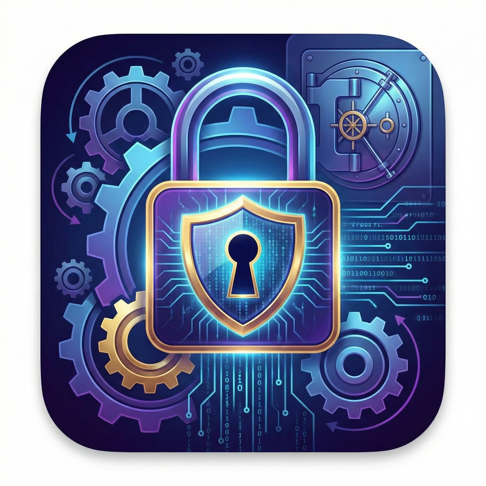

<div align="center">



# 🔐 Güvenli Kasam

**Şifreleriniz ve belgeleriniz her zaman yanınızda, güvende.**


</div>

---

## 📱 Uygulama Hakkında

**Güvenli Kasam**, şifrelerinizi ve belgelerinizi tek bir yerden güvenle yönetmenizi sağlayan mobil öncelikli (PWA) bir React uygulamasıdır. Telefonunuzun ana ekranına ekleyerek native uygulama deneyimi yaşayabilirsiniz.

---

## ✨ Özellikler

- 🔒 **Güvenli Giriş** — Kullanıcı adı & şifre ile kimlik doğrulama
- 🕐 **Otomatik Oturum** — 30 gün boyunca tekrar giriş yapmaya gerek yok
- 🔑 **Şifre Yöneticisi** — Şifreleri ekle, görüntüle (••• maskesi), sil
- 📄 **Belge Merkezi** — PDF belgelerini görüntüle veya indir
- 📲 **PWA / Ana Ekrana Ekle** — Safari/Chrome üzerinden ana ekrana eklenebilir
- 🌙 **Karanlık Tema** — Göz yormayan modern koyu arayüz
- 💾 **Yerel Depolama** — Tüm veriler cihazda, sunucuya gönderilmez

---

## 🚀 Kurulum & Çalıştırma

```bash
# Bağımlılıkları yükle
npm install

# Geliştirme sunucusunu başlat
npm run dev

# Üretim build
npm run build
```

Uygulama `http://localhost:5173` adresinde çalışır.

---

## 📁 Proje Yapısı

```
Password_Security/
├── public/
│   ├── logo.png            ← Uygulama logosu (PWA ikonu dahil)
│   ├── manifest.json       ← PWA manifest
│   ├── sw.js               ← Service Worker
│   ├── img/                ← Belge kartı görselleri
│   └── documents/          ← PDF dosyaları
└── src/
    ├── config/
    │   └── constants.js    ← Uygulama geneli sabitler (tek kaynak)
    ├── data/
    │   ├── users.js        ← Kullanıcı listesi
    │   ├── documentsData.js← Belge verileri
    │   └── passwordsData.js← Varsayılan şifreler
    ├── utils/storage.js    ← localStorage yardımcıları
    ├── hooks/useAuth.js    ← Kimlik doğrulama hook'u
    └── components/
        ├── common/         ← Button, Loading, Modal
        ├── layout/         ← Navbar
        ├── auth/           ← LoginScreen
        ├── home/           ← HomeScreen
        ├── passwords/      ← PasswordsScreen
        └── documents/      ← DocumentsScreen
```

---

## 📲 Mobilde Ana Ekrana Ekleme

### iOS (Safari)
1. Uygulamayı Safari'de aç
2. Alt menüden **Paylaş** butonuna dokun
3. **"Ana Ekrana Ekle"** seçeneğini seç
4. İsmi onayla → **Ekle**

### Android (Chrome)
1. Uygulamayı Chrome'da aç
2. Sağ üstten **⋮ Menü** → **"Ana Ekrana Ekle"**
3. Onayla → Ana ekranda uygulama ikonu görünür

---

## ⚙️ Kişiselleştirme

### Yeni belge eklemek
1. PDF'i `public/documents/` klasörüne koy
2. Görselini `public/img/` klasörüne koy
3. `src/data/documentsData.js` dosyasına yeni satır ekle

### Yeni kullanıcı eklemek
`src/data/users.js` dosyasına yeni `{ username, password }` nesnesi ekle.

### Oturum süresini değiştirmek
`src/config/constants.js` içindeki `SESSION_DURATION_MS` değerini güncelle.

---

## 🛡️ Güvenlik Notu

Tüm veriler yalnızca **cihazın yerel depolama alanına (localStorage)** kaydedilir. Hiçbir veri dış sunucuya gönderilmez.

---

<div align="center">
  <sub>Made with ❤️ by Bartu Özaşcı</sub>
</div>

